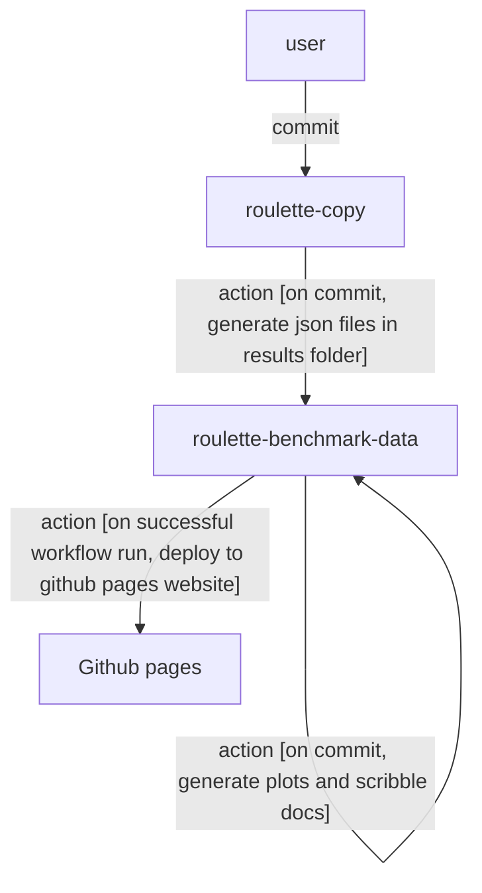

# README
## You can view the latest Benchmark results summary [here](https://roulette-ppl.github.io/roulette-benchmark-data/)

# workflow diagram

```mermaid
graph TD
A[user] -- commit --> B[roulette-copy]

B -- action [on commit, generate json files in results folder] --> C[roulette-benchmark-data]

C -- action [on commit, generate plots and scribble docs] --> C

C -- action [on successful workflow run, deploy to github pages website] --> D[Github pages]
```